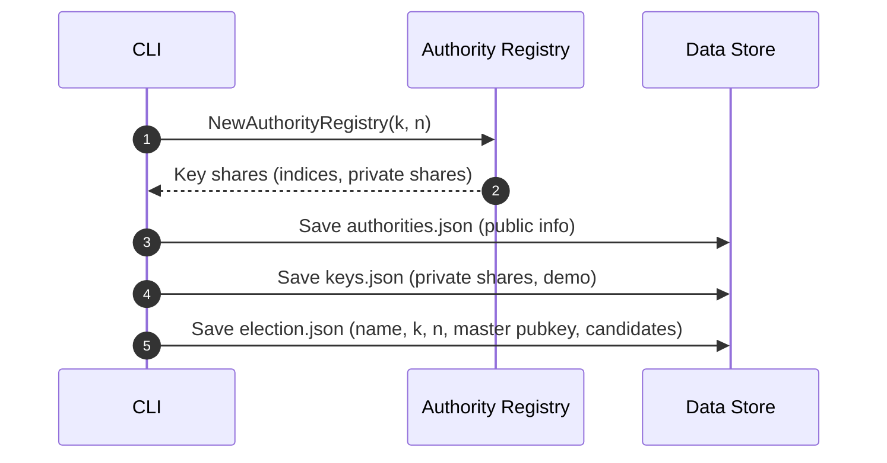
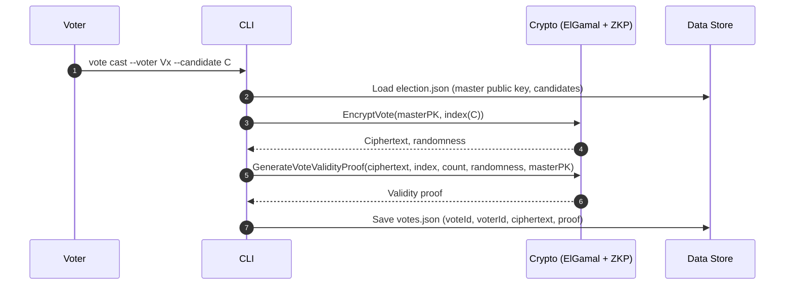
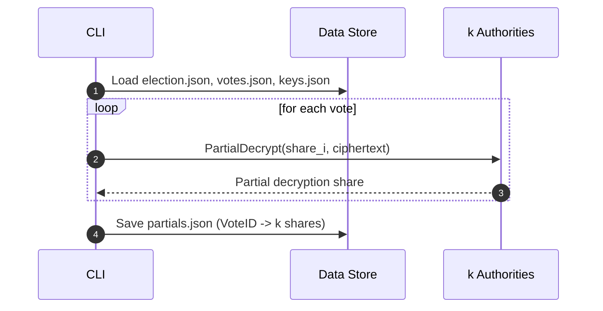
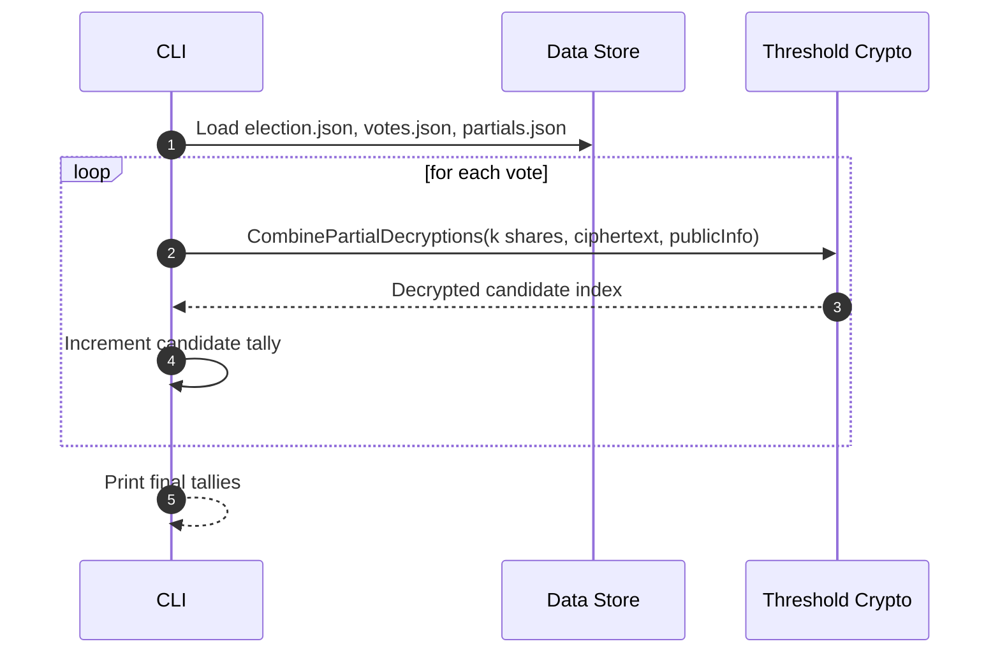

# E‑Voting Demo CLI

This repo provides a complete, self‑contained CLI demo of a threshold‑encrypted e‑voting system. It shows how to set up an election, register voters, cast votes with zero‑knowledge validity proofs, release threshold decryption shares, and compute results.

Use this README as a hands‑on guide. It explains both how to run the demo and how each feature works under the hood with pointers to the source files.

## Quick Start
- Prerequisites: Go 1.21+, macOS/Linux.
- Build the CLI:
    - `go build -o bin/evoting-cli ./cmd/cli`
- Run help:
    - `./bin/evoting-cli`

Environment:
- Data is stored in `data/` by default. Override with `EVOTING_DATA_DIR`.

## CLI Overview
`evoting-cli <command> [subcommand] [flags]`
- `election`: create/reset the election and threshold keys.
- `voter`: add voters and (demo) freeze list.
- `vote`: cast encrypted votes with validity proofs; publish/verify (demo).
- `keys`: release authority partial decryptions.
- `results`: combine partials to decrypt votes and count.
- `booth` and `export`: placeholders in this demo.

Entry point: `cmd/cli/main.go`. State and storage: `cmd/cli/state.go`.

## Demo Walkthrough
### 1) Create Election (Threshold Setup)
Command:
- `./bin/evoting-cli election create --name "Demo" --candidates Alice,Bob,Charlie --n 3 --k 2`

What happens:
- Generates threshold key shares for `n` authorities with decryption threshold `k` using `authority.NewAuthorityRegistry(k, n)`.
- Stores the master public key and authority info in `data/election.json`, `data/authorities.json`, and private shares in `data/keys.json` (demo only).
- Candidates are persisted in `election.json`.

Relevant code:
- `cmd/cli/cmd_election.go:createElection`
- `authority/registry.go` (key share generation)
- `cmd/cli/state.go` (JSON persistence)

Sequence (threshold setup):


### 2) Register Voters
Command:
- `./bin/evoting-cli voter add --id V1 --booth B1`
- `./bin/evoting-cli voter add --id V2 --booth B1`

What happens:
- Generates a fresh ECDSA keypair per voter with `crypto.GenerateKeyPair()`.
- Stores `publicKey`, demo `privateKey`, and a simple `votingToken` in `data/voters.json`.

Relevant code:
- `cmd/cli/cmd_voter.go:addVoter`
- `crypto/ecc.go:GenerateKeyPair` (called via `crypto.GenerateKeyPair`)

### 3) Cast Votes (Encryption + ZK Proof)
Command:
- `./bin/evoting-cli vote cast --voter V1 --candidate Alice`
- `./bin/evoting-cli vote cast --voter V2 --candidate Bob`

What happens:
- Loads the master public key from `election.json`.
- Maps the chosen candidate to an index.
- Encrypts the vote with ElGamal on P‑256: `crypto.EncryptVote(masterPub, index)` returns `(ciphertext, randomness)`.
- Generates a zero‑knowledge validity proof that the ciphertext encodes a choice in `[0, candidatesCount)`: `crypto.GenerateVoteValidityProof(...)`.
- Saves the vote to `data/votes.json`. If a voter re‑casts, the demo enforces “last vote counts” by replacing prior entries.

Relevant code:
- `cmd/cli/cmd_vote.go:castVote`
- `crypto/ecc.go` and `crypto/zkp.go` implementations invoked via `crypto/*.go`

Sequence (cast vote):


### 4) Release Threshold Shares (Authorities)
Command:
- `./bin/evoting-cli keys release`

What happens:
- Loads `election.json`, `votes.json`, and the demo `keys.json` containing `k` private shares.
- For each vote, computes `k` partial decryptions: `crypto.PartialDecrypt(share, ciphertext)`.
- Saves all partials to `data/partials.json`.

Relevant code:
- `cmd/cli/cmd_results.go:releaseKeys`
- `crypto/threshold.go:PartialDecrypt` and related types

Sequence (release keys and partials):


### 5) Compute Results (Combine Partials)
Command:
- `./bin/evoting-cli results`

What happens:
- Loads `election.json`, `votes.json`, and `partials.json`.
- For each vote, combines the `k` partial shares against public threshold info to recover the encrypted candidate index: `crypto.CombinePartialDecryptions(...)`.
- Tallies counts per candidate and prints results.

Relevant code:
- `cmd/cli/cmd_results.go:handleResultsCommand`
- `crypto/threshold.go:CombinePartialDecryptions`

Sequence (count results):


## Feature Details
- Eligibility Proofs: Each vote includes a zero‑knowledge validity proof ensuring the choice is within the valid candidate range. See `crypto/zkp.go`, invoked from `cmd/cli/cmd_vote.go`.

- Double Voting Handling: The demo uses a pragmatic rule — “last vote counts.” When `castVote` saves a new vote, it removes prior votes with the same `voterId`. See `cmd/cli/cmd_vote.go`.

- Threshold Encryption: Votes are encrypted under a master ElGamal public key derived from `n` authorities; any `k` shares can decrypt via partial decryptions combined later. See `authority/registry.go`, `crypto/threshold.go`, and CLI glue in `cmd/cli/cmd_election.go`, `cmd/cli/cmd_results.go`.

- Partial Decryptions: `keys release` computes partial decryptions for each vote using the stored private shares (demo). In production, authorities would publish signed partials with verifiable points; the demo skips signature/point verification. See `cmd/cli/cmd_results.go:releaseKeys`.

- Tallying Approach: Given the current `EncryptVote` encodes a single candidate index, the demo decrypts each vote individually and tallies, rather than homomorphic summation across a vector. See comments in `cmd/cli/cmd_results.go`.

- Storage & State: All entities persist as JSON in `data/`: `election.json`, `authorities.json`, `keys.json` (demo), `voters.json`, `votes.json`, `partials.json`. Helpers in `cmd/cli/state.go`.

## End‑to‑End Demo Script
```zsh
# 0) Build
go build -o bin/evoting-cli ./cmd/cli

# 1) Create election with 3 authorities, threshold 2
./bin/evoting-cli election create --name "Demo" --candidates Alice,Bob,Charlie --n 3 --k 2

# 2) Add voters
./bin/evoting-cli voter add --id V1 --booth B1
./bin/evoting-cli voter add --id V2 --booth B1

# 3) Cast votes
./bin/evoting-cli vote cast --voter V1 --candidate Alice
./bin/evoting-cli vote cast --voter V2 --candidate Bob

# 4) Release keys (generate partial decryptions)
./bin/evoting-cli keys release

# 5) Compute results
./bin/evoting-cli results
```

## Notes for Experts
- Curve and ElGamal setup: P‑256, with ciphertexts and points stored via JSON; master public key serialized as concatenated hex `X||Y` in `election.json` (64+64 hex chars).
- Security caveats: This demo keeps private authority shares and voter private keys in JSON; it skips verification of partials (no verification points). Publishing and mixnet steps are stubbed.
- Extensibility: For homomorphic tallying without per‑vote decryption, use vector or exponential ElGamal encoding and either per‑candidate ciphertext or compressed encodings with range proofs; add verification points and signatures to validate authority partials.

## Troubleshooting
- “Did you run 'keys release'?”: `results` requires `data/partials.json` generated by `keys release`.
- Invalid candidate error: Ensure the candidate name is in `election.json`.
- Change data dir: `EVOTING_DATA_DIR=/tmp/evote ./bin/evoting-cli ...`

## Repo Pointers
- CLI commands: `cmd/cli/*.go`
- Crypto and ZK proofs: `crypto/*.go`
- Threshold authority setup: `authority/registry.go`
- Core demo programmatic API: `evoting.go`
## 💻 Core Library

The core logic is designed to be used as a Go library:

- **`evoting`**: Main system package.
- **`crypto`**: Elliptic curve operations, threshold schemes, ZK proofs.
- **`authority`**: Authority management and key generation.
- **`vote`**: Vote management.
- **`voter`**: Voter registry.
- **`verification`**: Verification utilities.

### Example Library Usage

```go
import (
    "fmt"
    "github.com/naugustin/e-voting"
)

func main() {
    // Initialize system with threshold (k=3, n=5)
    system, _ := evoting.NewVotingSystem()
    system.SetupThresholdAuthorities(3, 5)

    // Register candidates
    system.RegisterCandidate("Alice")
    system.RegisterCandidate("Bob")

    // Register voter
    voter, _ := system.RegisterVoter("voter1", "booth-1")

    // Cast vote
    encryptedVote, _ := system.CastVote(voter, "Alice")
    fmt.Printf("Vote cast! ID: %s\n", encryptedVote.VoteID)
}
```

## 🧪 Testing

This project emphasizes testing integrity:

```bash
# Run core library unit tests
make test

# Run CLI integration tests (Python)
make test-cli
```

## 📦 Project Structure

```
e-voting/
├── evoting.go              # Core voting system facade
├── cmd/
│   └── cli/                # CLI application source
├── crypto/                 # Cryptographic primitives (ECC, Threshold, ZKP)
├── authority/              # Authority management
├── vote/                   # Vote logic
├── voter/                  # Voter registry
├── verification/           # Verification logic
├── analytics/              # Analytics engine
└── cli_test.py             # Integration test suite
```

## 🔐 Security Properties

- **Vote Privacy**: Hardness of Discrete Logarithm (Elliptic Curve).
- **Vote Integrity**: Votes cannot be modified once cast.
- **Anonymity**: Separated by threshold keys.

## 📄 License

MIT
